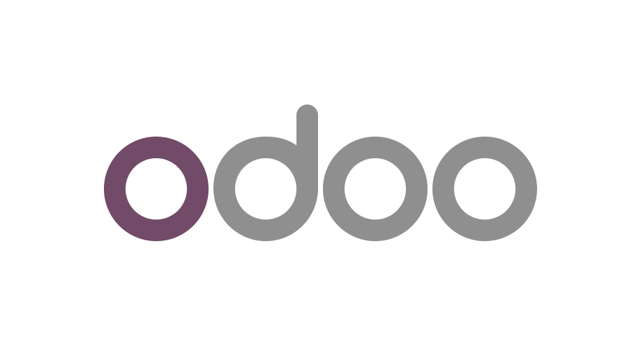

<p align="center">
  <a href="https://www.odoo.com"></a>
  &nbsp;&nbsp;&nbsp;&nbsp;
  <a href="https://modelcontextprotocol.io"></a>
</p>

<h1 align="center">odoo-mcp</h1>

---

> **"Show me all unpaid invoices over €5,000 from Q4"** — and Claude queries your Odoo instance directly.
> No copy-pasting, no CSV exports, no switching tabs.

An MCP server that connects Claude to Odoo. Runs as a Docker container; each user authenticates with their own Odoo API key as the Bearer token, so Odoo's access controls apply per-user.

The server passes the incoming `Authorization: Bearer` token straight through to Odoo — no separate credential store, no OAuth layer. Odoo validates the token and enforces its own access rules.

## Quick start

```bash
docker run -d \
  -e ODOO_URL=https://your-odoo.com \
  -e ODOO_DB=your_database \
  -e ODOO_API_VERSION=json2 \
  -p 8000:8000 \
  ghcr.io/glodouk/odoo-mcp:latest
```

```bash
docker run -d \
  -e ODOO_URL=https://your-odoo.com \
  -e ODOO_DB=your_database \
  -e ODOO_API_VERSION=xmlrpc \
  -p 8000:8000 \
  ghcr.io/glodouk/odoo-mcp:latest
```

Each user authenticates with their own Odoo API key as the Bearer token. For XML-RPC ensure that you use `username:api_key`. 
**Alternatively, run locally with `uvx`** (stdio transport — API key is set once in the environment):

## Configuration

| Variable | Required | Description |
|----------|----------|-------------|
| `ODOO_URL` | Yes | Odoo server URL, e.g. `https://mycompany.odoo.com` |
| `ODOO_DB` | Yes* | Database name. *Not needed for single-database Odoo.sh instances. |
| `ODOO_API_VERSION` | No | `json2` (Odoo 19+, default: `xmlrpc`) |
| `ODOO_MCP_PORT` | No | Port to listen on (default: `8000`) |
| `ODOO_READONLY` | No | `false` = enable write tools (default: `true`) |

### API versions

**JSON/2** (`ODOO_API_VERSION=json2`) — Odoo 19+. Bearer token is a plain Odoo API key.

**XML-RPC** (default) — Odoo 14–18. Bearer token must be `username:api_key` (the server needs a username to call `common.authenticate`).

## Tools

| Tool | What it does |
|------|-------------|
| `search_records` | Search any model with domain filters, sorting, pagination |
| `get_record` | Fetch a specific record by ID with smart field selection |
| `list_models` | Discover available Odoo models |
| `create_record` | Create a new record (requires `ODOO_READONLY=false`) |
| `update_record` | Update fields on an existing record (requires `ODOO_READONLY=false`) |
| `delete_record` | Delete a record (requires `ODOO_READONLY=false`) |

Plus **4 MCP resources** for URI-based access to records, search results, field definitions, and record counts.

**Example questions:**
- *"Find all contacts in Amsterdam with open quotations"*
- *"Create a lead for Acme Corp, expected revenue €50k"*
- *"Which sales orders from last month don't have a delivery yet?"*
- *"What fields does the sale.order model have?"*

## Docker Compose

```yaml
services:
  odoo-mcp:
    image: ghcr.io/your-org/odoo-mcp:latest
    environment:
      ODOO_URL: https://your-odoo.com
      ODOO_DB: your_database
      ODOO_API_VERSION: json2
    ports:
      - "8000:8000"
    restart: unless-stopped
```

## Releasing

Push a version tag to build and publish the Docker image to `ghcr.io`:

```bash
git tag v1.0.0
git push origin v1.0.0
```

CI will run lint and tests, then push `ghcr.io/<owner>/odoo-mcp-pro:1.0.0`, `:1.0`, and `:1`.

## Development

```bash
uv venv --python 3.12
source .venv/bin/activate
uv pip install -e ".[dev]"
pytest tests/ -q
```

## License

[Mozilla Public License 2.0](LICENSE)

Originally forked from [mcp-server-odoo](https://github.com/ivnvxd/mcp-server-odoo) by Andrey Ivanov (MPL-2.0), via [odoo-mcp-pro](https://github.com/pantalytics/odoo-mcp-pro) by pantalytics.

This module takes a different path from upstream, 100% delegating permissions to the
user's permissions in Odoo, plus a ODOO_READONLY param.
